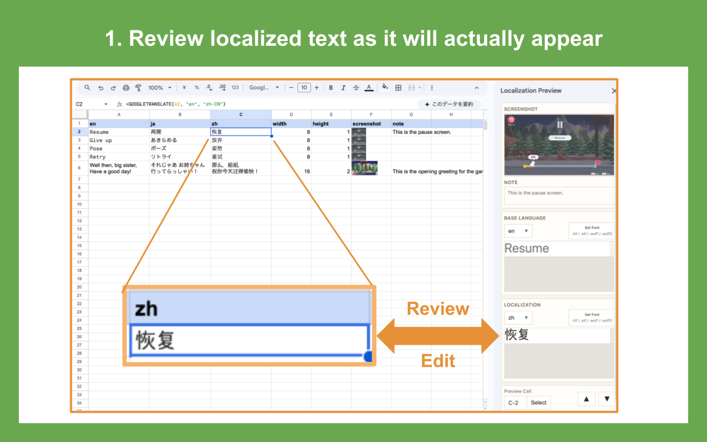
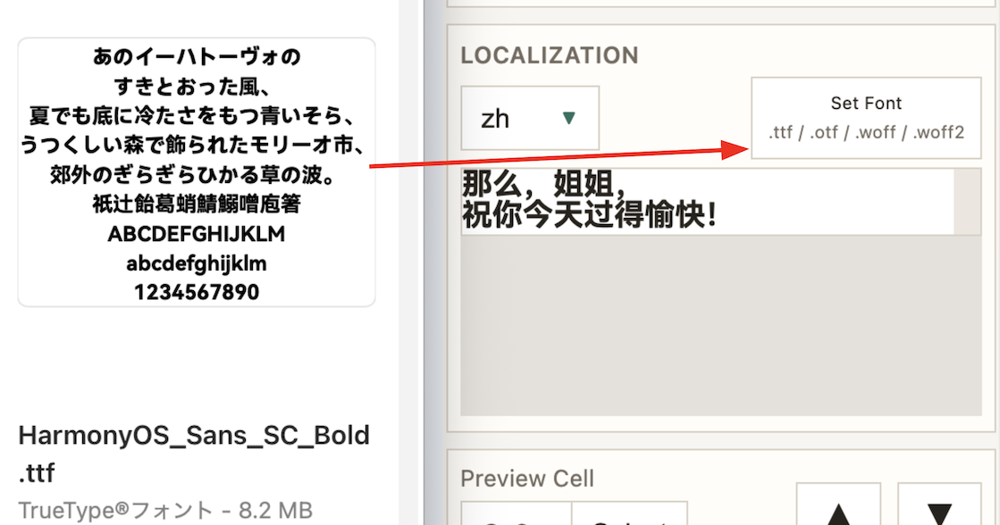
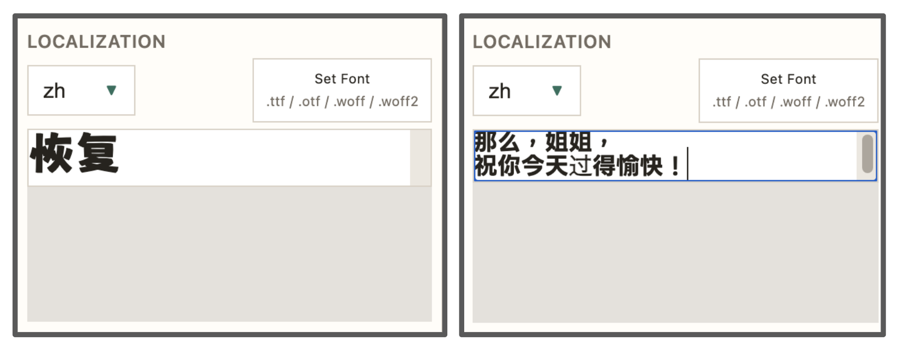
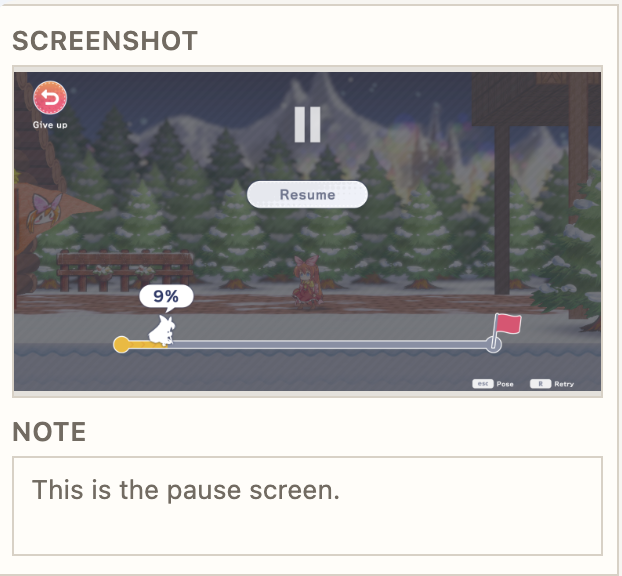

# Google Sheets Font Preview

Google Sheets Font Preview is a Google Apps Script sidebar for reviewing and editing large amounts of text in **Google Sheets** while previewing it with **real local font files**.

It is useful for localization, translation review, font-aware copy checking, and any workflow where people need to compare spreadsheet text with its actual visual look before using it in an app, website, game, document, or other product.

## Features

### Show font-based text preview in a Google Sheets sidebar

Preview spreadsheet text inside a Google Sheets sidebar while keeping the review workflow close to the source data.



### Set fonts by drag and drop from your PC

Load local font files (`.ttf`, `.otf`, `.woff`, `.woff2`) directly into the sidebar and preview text with the assigned font.



### Edit in real time while previewing text

Edit text directly from the sidebar while checking how it fits inside `width` and `height` constraints. This also helps reveal missing or unsupported glyphs in the selected font.



### Add screenshot and note context for translators

Use `screenshot` and `note` columns to show extra context needed for translation, review, and QA work.



## Quick Start

### Use directly in Apps Script

1. Open your target Google Sheet.
2. Open `Extensions > Apps Script`.
3. Copy these files into the Apps Script project:
   - [`src/Code.gs`](src/Code.gs)
   - [`src/Sidebar.html`](src/Sidebar.html)
   - [`src/Config.gs`](src/Config.gs)
4. Save the project.
5. Reload the spreadsheet.
6. Open `Localization > Font Preview`.

### Use with clasp

```bash
npm install
npm run setup-clasp
npm run push-clasp
```

Then reload the spreadsheet and open `Localization > Font Preview`.

You can also pass your Apps Script URL or raw `scriptId` to setup:

```bash
npm run setup-clasp -- https://script.google.com/home/projects/<scriptId>/edit
```

## Contributing

Contributions are welcome.

- Open an issue for bugs, UX problems, or feature requests
- Open a pull request for fixes or improvements
- Improve documentation, setup flow, or usability

For contribution details, see [CONTRIBUTING.md](CONTRIBUTING.md).

## License

MIT. See [LICENSE](LICENSE).
